# 상권 분석

> pandas를 활용한 상권 분석 및 시각화


### 라이브러리

```python
import numpy as np
import pandas as pd
import matplotlib as mp
import matplotlib.pyplot as plt
import seaborn as sns
```


### 한글화

- 그래프를 생성할 때 한글이 깨지는 것을 방지하기 위해 한글화 설정

```python
fm = mp.font_manager.FontManager()
plt.rcParams['font.family'] = 'Malgun Gothic'
```


### 데이터 불러오기

```python
df_seoul = pd.read_csv('pdsample/seoul_20200630.csv', sep='|')
```

- `sep='|'`: |로 분리하여 데이터를 가져옴


### 데이터 확인하기


##### 데이터 일부 확인

데이터의 일부를 확인하여 어떤식으로 구성되어 있는지 확인

- 상가업소번호, 상호명, 지점명, 경도, 위도 등의 데이터를 가지고 있음

```python
df_seoul.head()
```


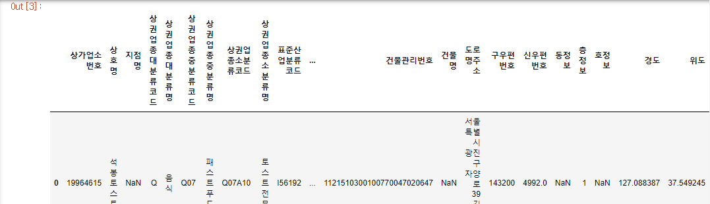


##### 데이터 구조

해당 데이터의 행과 열의 개수를 확인

- 370321행, 39열로 구성되어 있음

`shape()`

행과 열의 개수를 튜플로 반환

```python
df_seoul.shape
```

```python
out:
(370321, 39)
```

`coulumns`

데이터의 컬럼명 확인

```python
df_seoul.columns
```

```python
out:
Index(['상가업소번호', '상호명', '지점명', '상권업종대분류코드', '상권업종대분류명', '상권업종중분류코드',
       '상권업종중분류명', '상권업종소분류코드', '상권업종소분류명', '표준산업분류코드', '표준산업분류명', '시도코드',
       '시도명', '시군구코드', '시군구명', '행정동코드', '행정동명', '법정동코드', '법정동명', '지번코드',
       '대지구분코드', '대지구분명', '지번본번지', '지번부번지', '지번주소', '도로명코드', '도로명', '건물본번지',
       '건물부번지', '건물관리번호', '건물명', '도로명주소', '구우편번호', '신우편번호', '동정보', '층정보',
       '호정보', '경도', '위도'],
      dtype='object')
```


### 데이터 가공하기

##### 결측치 시각화

- missingno 라이브러리 다운 후 임포트

```python
!pip install missingno
```

```python
import missingno as msno
```

```python
msno.matrix(df_seoul)
```

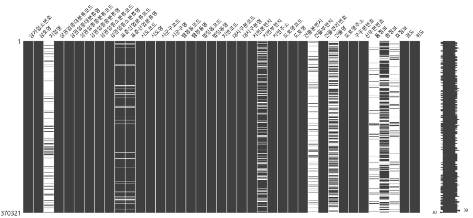


### 상권업종 분류별 시각화

##### 대분류별

```python
sns.countplot(data=df_seoul, y="상권업종대분류명")
```

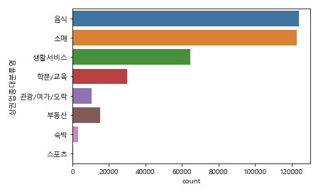

##### 중분류별

- 대분류가 음식인 경우

```python
df_food = df_seoul.loc[df_seoul['상권업종대분류명'].str.contains('음식')]
```

```python
sns.countplot(data=df_food, y="상권업종중분류명")
```

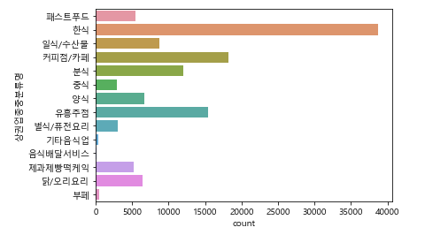

- 대분류가 소매인 경우

```python
df_retail = df_seoul.loc[df_seoul['상권업종대분류명'].str.contains('소매')]
```

```python
sns.countplot(data=df_retail, y='상권업종중분류명')
```

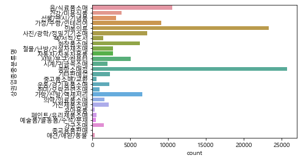


### 패스트푸드 상권 분석 (롯데리아/버거킹/맥도날드)

##### 데이터 추출

- 상권을 분석하기 위해 필요한 데이터만 뽑아서 저장

```python
data = df_seoul[['상호명','지점명','상권업종중분류명','시군구명','행정동명','도로명','경도','위도']]
data.head()
```

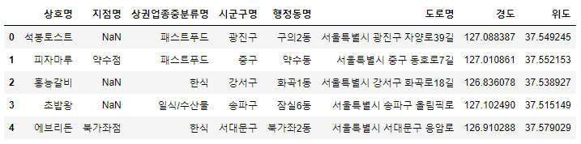


- 데이터 중에서도 상권업종중분류명이 패스트푸드인 데이터만 추출

```python
df_fast = data[data['상권업종중분류명']=='패스트푸드']
df_fast.head()
```

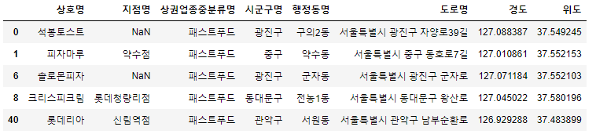


- 롯데리아/버거킹/맥도날드 데이터만 따로 추출해서 각자 저장

```python
df_fast_l= df_fast.loc[df_fast['상호명'].str.contains('롯데리아')]
df_fast_b= df_fast.loc[df_fast['상호명'].str.contains('버거킹')]
df_fast_m= df_fast.loc[df_fast['상호명'].str.contains('맥도날드')]
```

- 롯데리아/버거킹/맥도날드 브랜드명 칼럼 생성

```python
df_fast_total.loc[df_fast_total['상호명'].str.contains('롯데리아'),'브랜드명']='롯데리아'
df_fast_total.loc[df_fast_total['상호명'].str.contains('버거킹'),'브랜드명']='버거킹'
df_fast_total.loc[df_fast_total['상호명'].str.contains('맥도날드'),'브랜드명']='맥도날드'
```

- 롯데리아/버거킹/맥도날드 데이터를 모두 포함해서 저장

```python
df_fast_total = df_fast.loc[df_fast['상호명'].str.contains('롯데리아|버거킹|맥도날드')].copy()
```

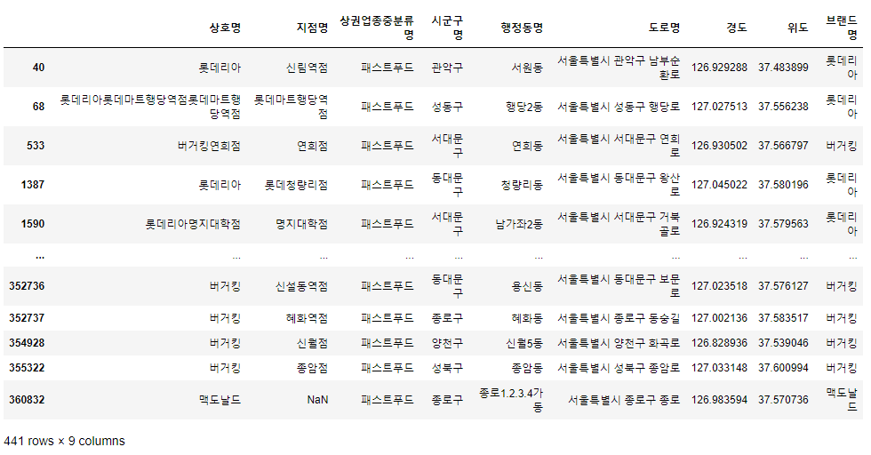


##### 지도에 표시

- folium 라이브러리 저장후 임포트

```python
!pip install folium
```

```python
import folium
```

```python
geo_df_fast = df_fast_total
```

- 지도 생성
  - 위도와 경도의 평균값을 추출해서 위치 지정
  - 롯데리아는 빨간색, 버거킹은 주황색, 맥도날드는 노란색으로 지도에 마커 표시
  - 마커를 클릭하면 지점명과 주소가 나타나도록 설정

```python
map = folium.Map(location=[geo_df_fast['위도'].mean(), 
                           geo_df_fast['경도'].mean()],
                           zoom_start=12)

for n in geo_df_fast.index:
    popup_name = geo_df_fast.loc[n,'상호명'] + ' - '\
    + geo_df_fast.loc[n,'도로명']
    
    if geo_df_fast.loc[n,'브랜드명']=='롯데리아':
        icon_color = 'red'
    elif geo_df_fast.loc[n,'브랜드명']=='버거킹':
        icon_color = 'orange'
    else:
        icon_color = 'yellow'


    folium.CircleMarker(
         location=[geo_df_fast.loc[n,'위도'],geo_df_fast.loc[n,'경도']],
         radius =3,
         popup = popup_name,
         color=icon_color,
         fill = True,
         fill_color=icon_color     

    ).add_to(map)
    
map
```

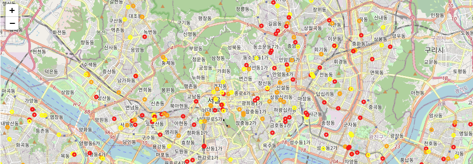

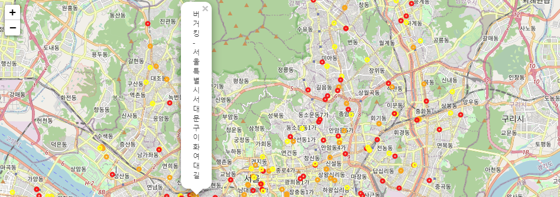


### 각 브랜드 별 매장수 시각화

##### 데이터 생성

```python
df_fast_brand = pd.DataFrame(df_fast_total.groupby(['시군구명','브랜드명'])['상호명'].count()).reset_index()
df_fast_brand.columns = ['구','브랜드명','매장수']
df_fast_brand.head()
```

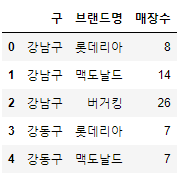

##### 데이터 시각화

```python
plt.figure(figsize=(24,6))
sns.barplot(data=df_fast_brand , x= '구', y='매장수', hue='브랜드명')
```

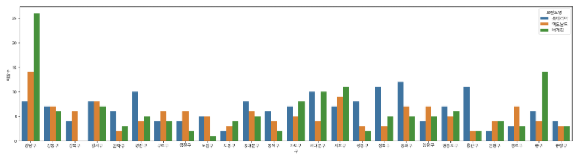
